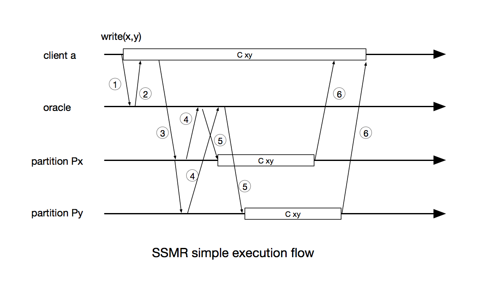
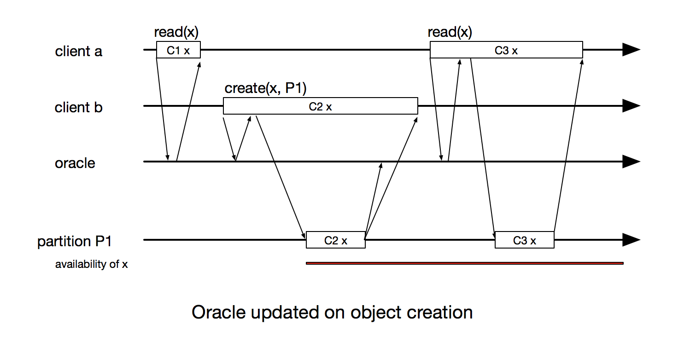
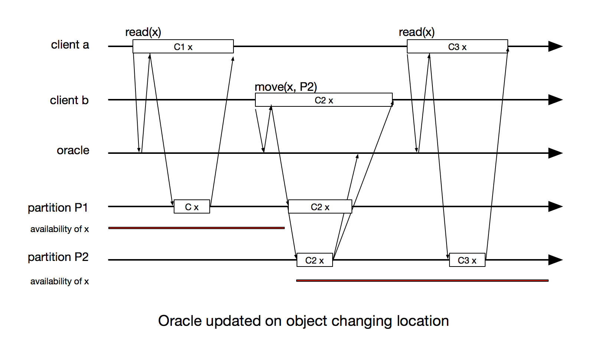

###Scalable State Machine Replication Implementation

**State Machine Replication** (SMR) is a well known method for implementing a fault-tolerant, high availability service. By having clients commands executed in the same other on all replicas, following the deterministic execution, producing same state of all replica for each client command. The original SMR model was not quite efficient since adding replica doesn't increase the performance or throughput, because all replicas still execute same number of commands. **Scalable State Machine Replication** (SSMR) then was introduced to address that problem by partitioning the application state, that allow client commands go through a combination of replicas, but not necessary all the replicas, while still maintain the consistency of the system.

SSMR implementation then bring into use the concept of **Oracle** which is the core of partitioning algorithms, which tell the system which partition(s) a command should be forwarded to, or on which partition(s) a state object could be located. The implementation of SSMR uses a basic version of Oracle which runs simple algorithm to return the combination of involved partition. It thus leaves an open door for the application designers to determine where a command/object should be located.

The current executing flow of the SSMR could be describe as
- 1. Client ask Oracle where to send the command
- 2. Oracles return set of partitions which involved in the command
- 3. Client send command to the set of involved partitions
- 4. Partitions ask the oracle which partitions have the objects in commands for exchanging
- 5. Oracles return set of partitions which contain the objects
- 6. Partitions exchange object execute the command and return response to the client

**Notes**
- Oracle is running independently on each client and partition. 
- Oracle is using static algorithm on static attribute of commands and objects to guaranty the consistency of result.

**Problems**
- In the case Oracle fails to return the set of partitions, a superset (which mean **all**) of partitions will be returned.
- Oracle's result has to be consistent for querying from both client and partition side.
- **All objects have to be available on all partitions** So all the objects have to be defined and created during the starting phase of the system.
- Under the above assumtion, object can't be created, nor exchanged between partition on the fly, since Oracles running independently, one won't know if another is updated (which will happend to reflect the changes of partition's object), thus it could lead to an out sync state between Oracles 
- Due to out of sync between oracle, one Oracle might return incorrect set of partition, which eventually brings down the consistency of the whole system.

###Enhancing Oracle

By observing the SSMR execution flow, we can see the important role of the proper implementation of the Oracle in the SSMR:
- Bases on the command and objects involved in the command, tell the client the combination of partitions to send the command to
- Base on the objects, tell partitions in the replica the partition(s) the objects are located.
- Return the most optimize set of partitions where the command is involved.
- Should be able to update itself in the case new objects are created, or moving accross the partitions.
- Works transparently to the upper layers. The application designers should now concerned about having the application run on multiple partitions, where to put the object, or where to forward the command, rather than only focus on developing application on a single partition as common sense.

Possible issues: Oracle may return wrong answer overlaping of update command.
