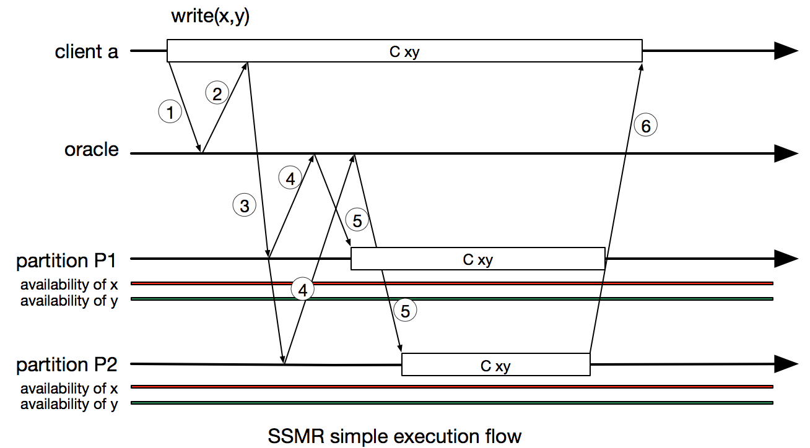
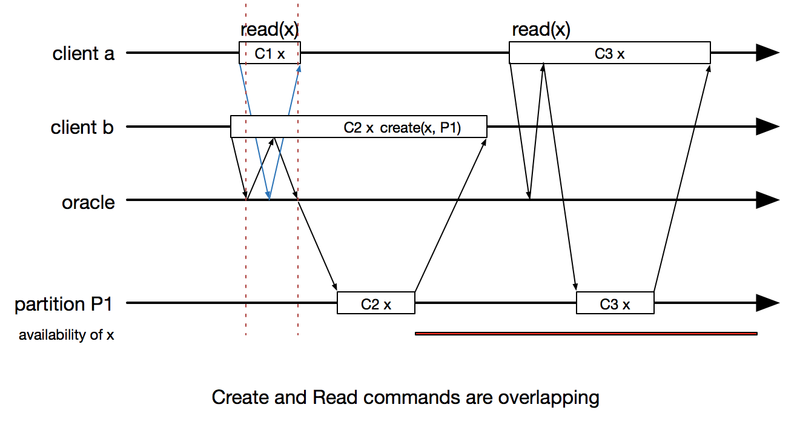
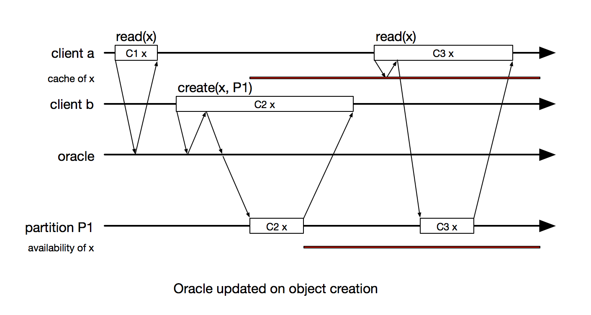
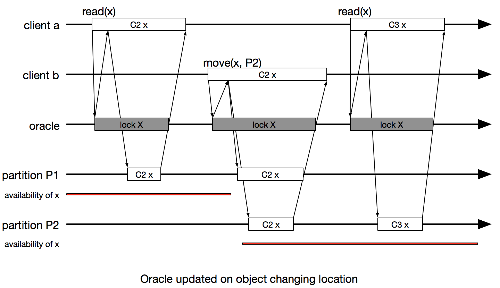
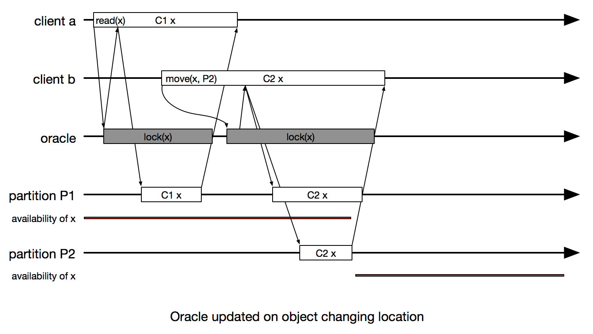
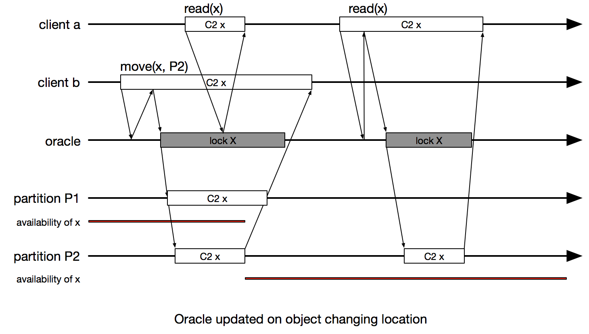

###Scalable State Machine Replication Implementation

| Revision | Review Date  |                       Changes                       |
|----------|--------------|-----------------------------------------------------|
|        1 | 2 Sept 2015  | Initial commit                                      |
|        2 | 9 Sept 2015  | - Multicast Create command to Oracle and Partitions |
|          |              | - Add locking mechanism for creating & updating     |
|          |              | - Adding caching mechanism for read command         |
|        3 | 16 Sept 2015 | - Command requires lock from first step             |
|          |              | - Add detail for caching mechanism                  |
|          |              | - Add summary figure for cases with detail steps    |

<!-- MarkdownTOC -->

- SSMR
- Enhancing Oracle
- ummary Case

<!-- /MarkdownTOC -->

## SSMR
**State Machine Replication** (SMR) is a well known method for implementing a fault-tolerant, high availability service. By having clients commands executed in the same other on all replicas, following the deterministic execution, producing same state of all replica for each client command. The original SMR model was not quite efficient since adding replica doesn't increase the performance or throughput, because all replicas still execute same number of commands. **Scalable State Machine Replication** (SSMR) then was introduced to address that problem by partitioning the application state, that allow client commands go through a combination of replicas, but not necessary all the replicas, while still maintain the consistency of the system.

SSMR implementation then bring into use the concept of **Oracle** which is the core of partitioning algorithms, which tell the system which partition(s) a command should be forwarded to, or on which partition(s) a state object could be located. The implementation of SSMR uses a basic version of Oracle which runs simple algorithm to return the combination of involved partition. It thus leaves an open door for the application designers to determine where a command/object should be located.

The current executing flow of the SSMR could be describe as
- 1. Client ask Oracle where to send the command
- 2. Oracles return set of partitions which involved in the command
- 3. Client send command to the set of involved partitions
- 4. Partitions ask the oracle which partitions have the objects in commands for exchanging
- 5. Oracles return set of partitions which contain the objects
- 6. Partitions exchange object execute the command and return response to the client

**Notes**
- Oracle is running independently on each client and partition. 
- Oracle is using static algorithm on static attribute of commands and objects to guaranty the consistency of result.

**Problems**
- In the case Oracle fails to return the set of partitions, a superset (which mean **all**) of partitions will be returned.
- Oracle's result has to be consistent for querying from both client and partition side.
- **All objects have to be available on all partitions** So all the objects have to be defined and created during the starting phase of the system.
- Under the above assumption, object can't be created, nor exchanged between partition on the fly, since Oracles running independently, one won't know if another is updated (which will happen to reflect the changes of partition's object), thus it could lead to an out sync state between Oracles 
- Due to out of sync between oracle, one Oracle might return incorrect set of partition, which eventually brings down the consistency of the whole system.

## Enhancing Oracle

By observing the SSMR execution flow, we can see the important role of the proper implementation of the Oracle in the SSMR:
- Bases on the command and objects involved in the command, tell the client the combination of partitions to send the command to
- Base on the objects, tell partitions in the replica the partition(s) the objects are located.
- Return the most optimize set of partitions where the command is involved.
- Should be able to update itself in the case new objects are created, or moving across the partitions.
- Should be able handle all possible cases together with their exceptions
- Works transparently to the upper layers. The application designers should now concerned about having the application run on multiple partitions, where to put the object, or where to forward the command, rather than only focus on developing application on a single partition as common sense.

### Creating object scenarios

**Case 1**: Read command and create command are not overlapping.

<!--- 
 Figure 2 
 -->

> 1. On the first **read** request, client 1 ask Oracle for location of X. Oracle doesn't have information of X at that time, thus return an empty response to the **read** request of the client 1, the request is finish when client 1 get the response from the oracle
> 2. Then another client (client 2) emits a **create** request, first it has to consult Oracle to get the associated partition, then multicast the **create** command to both Oracle and Partition(s). The partition P1 create object then response to the client. The request finish when client get the response from partition P1. Oracle also has the updated location of the object X
> 3. Client 1 issues another **read** command, at this time Oracle return the correct location of X (P1), then client 1 multicasts the **read** command to the Partition to read the object value, the request finish when client get the response from P1

**Case 2**: Read command and create command are overlapping when Oracle has not updated object's location

> 1. Client 2 asks Oracle for partition for **create** command, then multicasts command to Oracle and Partition (P1). In the moment between consulting oracle and multicasting command, Client 1 asks Oracle for location of X, Oracle still return empty result to client 1

**Case 3.1**: Read command and create command are overlapping when Oracle has object's location but the object is in creating process

> 1. Client 2 asks Oracle for partition for **create** command, then multicasts command to Oracle and Partition (P1). After multicasts step, Oracle updates object's location and Partition P1 starts creating object. In the moment after Oracle already has X's location and Partition is creating X, Client 1 asks Oracle for location of X, Oracle returns P1. Then Client sends the read command C1 to P1 while P1 is running creating command X C2. Since P1's execution is atomic, C1 will be executed after C2 finish

**Case 3.2**: Read command and create command are overlapping when Oracle has object's location but the object is not created

> 1. Client 2 asks Oracle for partition for **create** command, then multicasts command to Oracle and Partition (P1). After multicasts step, Oracle updates object's location and Partition P1 starts creating object. In the moment after Oracle already has X's location and Partition is creating X, Client 1 asks Oracle for location of X, Oracle returns P1 ->? 

**Performance Optimization by using Caching**

> Client and partition have a copy of oracle in local cache. Every time Oracle update, it also multicast the update command to all associated Client, Partition

### Updating object location scenarios

Possible issues: Oracle may return wrong answer overlapping of update command.

##Summary Case

###Question:
- When will version increase? When will the cache be updated
  + Client: 
- Should client update object location it self?

1. If clients don't have cached version of object's location, it will consult oracle for that information. 
2. Client A multicast read command to partition P1, together with cache version number of object X, if the P1 checks matched version, it will process the command, then return the result to A.
3. Client B multicast move command (which move object X from P1 to P2) with cache number to partition P1, P2 and the Oracle. Both check the version, update local cache, then execute the command
	- **Command which change the version of object**: Create, Move, *Update*(?)
4. Client A want to read X again, it multicasts command to P1 (as local cache version of X), P1 check not matched version then return fails, A consult Oracle again to get the new location of X. Then multicast command to P2. 
	- **Command involve Oracle need to require lock of that Object on Oracle**
	- **Command which require lock on object** read vs move
5. 
